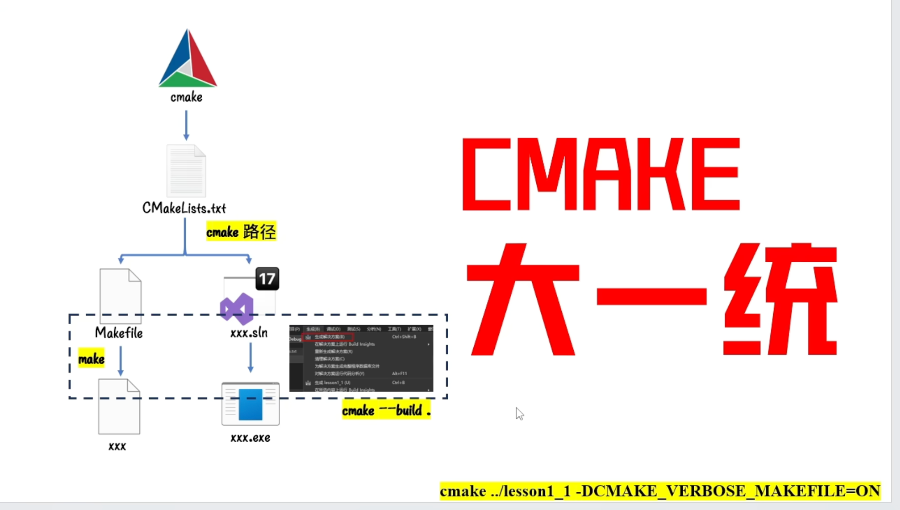

https://subingwen.cn/cmake/CMake-primer/#2-2-%E7%A7%81%E4%BA%BA%E8%AE%A2%E5%88%B6
## 1. CMake概述


CMake 是一个项目构建工具，并且是跨平台的。关于项目构建我们所熟知的还有Makefile（通过 make 命令进行项目的构建），大多是IDE软件都集成了make，比如：VS 的 nmake、linux 下的 GNU make、Qt 的 qmake等，如果自己动手写 makefile，会发现，makefile 通常依赖于当前的编译平台，而且编写 makefile 的工作量比较大，解决依赖关系时也容易出错。

而 CMake 恰好能解决上述问题， 其允许开发者指定整个工程的编译流程，在根据编译平台，`自动生成本地化的Makefile和工程文件`，最后用户只需`make`编译即可，所以可以把CMake看成一款自动生成 Makefile的工具，其编译流程如下图：

[](https://subingwen.cn/cmake/CMake-primer/image-20230309130644912.png)

*   蓝色虚线表示使用`makefile`构建项目的过程
*   红色实线表示使用`cmake`构建项目的过程

介绍完CMake的作用之后，再来总结一下它的优点：

*   跨平台
*   能够管理大型项目
*   简化编译构建过程和编译过程
*   可扩展：可以为 cmake 编写特定功能的模块，扩充 cmake 功能

## 2. CMake的使用


`CMake`支持大写、小写、混合大小写的命令。如果在编写`CMakeLists.txt`文件时使用的工具有对应的命令提示，那么大小写随缘即可，不要太过在意。

### 2.1 注释
--------------------

#### 2.1.1 注释行

`CMake` 使用 `#` 进行`行注释`，可以放在任何位置。


```shell 
# 这是一个 CMakeLists.txt 文件  
cmake_minimum_required(VERSION 3.0.0)  
```

#### 2.1.2 注释块

`CMake` 使用 `#[[ ]]` 形式进行`块注释`。

```shell
#[[ 这是一个 CMakeLists.txt 文件。  
这是一个 CMakeLists.txt 文件  
这是一个 CMakeLists.txt 文件]]  
cmake_minimum_required(VERSION 3.0.0)  
```

### 2.1 只有源文件
--------------------------

#### 2.1.1 共处一室

目录结构如下：
.  
├── add.c  
├── div.c  
├── head.h  
├── main.c  
├── mult.c  
└── sub.c

**添加 `CMakeLists.txt` 文件**

在上述源文件所在目录下添加一个新文件 CMakeLists.txt，文件内容如下：


```shell
cmake_minimum_required(VERSION 3.0)  
project(CALC)  
add_executable(app add.c div.c main.c mult.c sub.c)  
```

接下来依次介绍一下在 CMakeLists.txt 文件中添加的三个命令:

*   `cmake_minimum_required`：指定使用的 cmake 的最低版本
    
    *   **可选，非必须，如果不加可能会有警告**
*   `project`：定义工程名称，并可指定工程的版本、工程描述、web主页地址、支持的语言（默认情况支持所有语言），如果不需要这些都是可以忽略的，只需要指定出工程名字即可。
   
```shell    
    #PROJECT 指令的语法是：
    project(<PROJECT-NAME> [<language-name>...])
    project(<PROJECT-NAME>
        [VERSION <major>[.<minor>[.<patch>[.<tweak>]]]]
        [DESCRIPTION <project-description-string>]
        [HOMEPAGE_URL <url-string>]
        [LANGUAGES <language-name>...])
```


    
*   `add_executable`：定义工程会生成一个可执行程序
    

    add_executable(可执行程序名 源文件名称)  
    
    *   这里的可执行程序名和`project`中的项目名没有任何关系
        
    *   源文件名可以是一个也可以是多个，如有多个可用空格或`;`间隔

        add\_executable(app add.c div.c main.c mult.c sub.c)  

        add\_executable(app add.c;div.c;main.c;mult.c;sub.c)


万事俱备只欠东风，将 CMakeLists.txt 文件编辑好之后，就可以执行 cmake命令了。
```shell
    cmake ..
    make -j4
```
当执行cmake命令之后，CMakeLists.txt 中的命令就会被执行，所以一定要注意给cmake 命令指定路径的时候一定不能出错。

执行命令之后，看一下源文件所在目录中是否多了一些文件：
├── add.c
├── CMakeCache.txt         # new add file
├── CMakeFiles             # new add dir
├── cmake_install.cmake    # new add file
├── CMakeLists.txt
├── div.c
├── head.h
├── main.c
├── Makefile               # new add file
├── mult.c
└── sub.c


# CMake首先需要设置依赖包的最早版本 
cmake_minimum_required(3.3.10)

# 设置项目句柄，类似于IDE新建项目需要项目名
project(NAME)

# 原材料地址
add_subdirectory(./src)

# 减少头文件重复信息，将路径放在cmake管理(该方法出现在顶层cmake，会导致所有源文件的编译包含多余头文件)
include_directories(./include)

# 菜名 源文件地址
add_executable(main ./main.cpp)

# 编译静态库和动态库
add_library(static_lib ./static_lib.cpp)
add_library(shared_lib SHARED ./shared_lib.cpp)

# 链接

# 链接静态库的方式,两种方法等价
link_directories(./lib)
target_link_libraries(main static_lib)

link_libraries(./lib/static_lib)


# 需要注意的是，在windows中使用visualstudio编译器，编译动态库时，会生成shared.lib和shared.dll
# cmake中需要链接.lib，但是需要将.dll放到可执行文件夹活环境变量中。




## find_package规则
`find_package` 主要用于查找子模块的配置文件，主要会查找以下几种特定的变量和路径：

### 1. `<PackageName>_DIR`

`find_package` 会首先检查是否存在 `<PackageName>_DIR` 变量。在你的例子中，`<PackageName>` 是 `FFMPEG`，所以它会检查是否存在 `FFMPEG_DIR` 变量。如果这个变量被设置，`find_package` 会在该变量指定的路径中查找配置文件。

### 2. `CMAKE_PREFIX_PATH`

如果 `<PackageName>_DIR` 没有被设置，`find_package` 会检查 `CMAKE_PREFIX_PATH`。`CMAKE_PREFIX_PATH` 是一个包含多个路径的变量，CMake 会在这些路径中查找库的配置文件。这些路径通常是安装目录的根路径，例如 `/usr/local` 或 `/opt/somepackage`。

### 3. `CMAKE_FRAMEWORK_PATH`（仅限 macOS）

在 macOS 上，`find_package` 也会检查 `CMAKE_FRAMEWORK_PATH`，这是一个包含框架路径的变量。

### 4. 默认路径

如果上述路径都没有找到配置文件，`find_package` 会检查默认的系统路径。这些路径通常是 CMake 安装时配置的路径，例如：

*   `/usr/local/lib/cmake`
    
*   `/usr/lib/cmake`
    
*   `/usr/local/share/cmake`
    
*   `/usr/share/cmake`
    

### 5. `CMAKE_MODULE_PATH`

`find_package` 还会检查 `CMAKE_MODULE_PATH`，这是一个包含用户自定义模块路径的变量。如果用户在 `CMAKE_MODULE_PATH` 中指定了路径，CMake 会在这些路径中查找 `Find<PackageName>.cmake` 文件。

### 6. `CMAKE_SYSTEM_PREFIX_PATH`

`CMAKE_SYSTEM_PREFIX_PATH` 是一个包含系统级安装路径的变量，CMake 也会在这些路径中查找库的配置文件。

### 具体查找过程


    set(FFMPEG_DIR /opt/sophon/sophon-ffmpeg-latest/lib/cmake)
    find_package(FFMPEG REQUIRED)

1.  **检查 `FFMPEG_DIR`**：
    
    *   `find_package` 首先检查是否存在 `FFMPEG_DIR` 变量。在你的代码中，`FFMPEG_DIR` 被设置为 `/opt/sophon/sophon-ffmpeg-latest/lib/cmake`。
        
    *   因此，`find_package` 会在 `/opt/sophon/sophon-ffmpeg-latest/lib/cmake` 路径中查找 `FFmpegConfig.cmake` 或 `ffmpeg-config.cmake` 文件。
        
2.  **如果 `FFMPEG_DIR` 没有被设置**：
    
    *   如果 `FFMPEG_DIR` 没有被设置，`find_package` 会检查 `CMAKE_PREFIX_PATH`。
        
    *   如果 `CMAKE_PREFIX_PATH` 也没有找到配置文件，`find_package` 会检查默认的系统路径。
        

### 总结

`find_package` 不会检查 CMake 的所有变量，而是按照特定的规则和顺序来查找库的配置文件。它主要会检查以下变量和路径：

1.  `<PackageName>_DIR`（例如 `FFMPEG_DIR`）
    
2.  `CMAKE_PREFIX_PATH`
    
3.  `CMAKE_FRAMEWORK_PATH`（仅限 macOS）
    
4.  默认路径
    
5.  `CMAKE_MODULE_PATH`
    
6.  `CMAKE_SYSTEM_PREFIX_PATH`
    

通过这种方式，`find_package` 可以灵活地找到库的配置文件，而用户可以通过设置特定的变量（如 `<PackageName>_DIR`）来明确指定库的路径。

## find_library

`find_library` 是 CMake 中用于查找库文件的命令，与 `find_package` 不同，`find_library` 直接查找动态库或静态库文件（如 `.so`、`.a`、`.dll` 等）。它的主要作用是帮助项目找到特定的库文件，并将其路径存储在一个变量中，供后续的链接操作使用。

### `find_library` 的基本语法

`find_library` 的基本语法如下：


``` shell
    find_library(<VAR> <NAMES> <NAME1> [<NAME2> ...] [PATHS <PATH1> [<PATH2> ...]]
                 [DOC "Help message"] [NO_DEFAULT_PATH] [NO_CMAKE_ENVIRONMENT_PATH]
                 [NO_CMAKE_PATH] [NO_SYSTEM_ENVIRONMENT_PATH] [NO_CMAKE_SYSTEM_PATH]
                 [CMAKE_FIND_ROOT_PATH_BOTH | ONLY_CMAKE_FIND_ROOT_PATH |
                  NO_CMAKE_FIND_ROOT_PATH])
```

*   `<VAR>`：用于存储找到的库文件路径的变量名。
    
*   `<NAMES>`：要查找的库文件的名称。可以指定多个名称，CMake 会依次查找。
    
*   `<NAME1>`、`<NAME2>`：库文件的名称，可以是不带扩展名的名称（如 `avcodec`），也可以是带扩展名的名称（如 `libavcodec.so`）。
    
*   `[PATHS <PATH1> [<PATH2> ...]]`：指定额外的搜索路径。如果指定了 `PATHS`，CMake 会在这些路径中查找库文件。
    
*   `[DOC "Help message"]`：为变量 `<VAR>` 提供帮助信息。
    
*   `[NO_DEFAULT_PATH]`：不使用默认的搜索路径。
    
*   `[NO_CMAKE_ENVIRONMENT_PATH]`：不使用 `CMAKE_LIBRARY_PATH` 环境变量。
    
*   `[NO_CMAKE_PATH]`：不使用 `CMAKE_PREFIX_PATH`。
    
*   `[NO_SYSTEM_ENVIRONMENT_PATH]`：不使用系统的环境变量路径。
    
*   `[NO_CMAKE_SYSTEM_PATH]`：不使用系统的默认路径。
    
*   `[CMAKE_FIND_ROOT_PATH_BOTH | ONLY_CMAKE_FIND_ROOT_PATH | NO_CMAKE_FIND_ROOT_PATH]`：控制如何使用 `CMAKE_FIND_ROOT_PATH`。
    

### 示例

假设你需要查找 FFmpeg 的 `libavcodec` 库文件，可以使用以下代码：

cmake

复制

    find_library(AVCODEC_LIBRARY avcodec
                 PATHS /opt/sophon/sophon-ffmpeg-latest/lib
                 DOC "Path to the avcodec library")

### 解释

1.  **变量 `<VAR>`**：
    
    *   `AVCODEC_LIBRARY`：这是存储找到的库文件路径的变量名。
        
2.  **库文件名称 `<NAMES>`**：
    
    *   `avcodec`：这是要查找的库文件的名称。CMake 会根据系统和编译器的约定，自动查找可能的文件名，如 `libavcodec.so`（在 Linux 上）或 `avcodec.lib`（在 Windows 上）。
        
3.  **额外的搜索路径 `[PATHS]`**：
    
    *   `/opt/sophon/sophon-ffmpeg-latest/lib`：这是指定的额外搜索路径。CMake 会在这些路径中查找库文件。
        
4.  **帮助信息 `[DOC]`**：
    
    *   `"Path to the avcodec library"`：这是为变量 `AVCODEC_LIBRARY` 提供的帮助信息，可以在 CMake 的 GUI 或文档中显示。
        

### 使用找到的库文件

一旦找到库文件路径，你可以在项目中使用该路径进行链接。例如：


    target_link_libraries(my_target ${AVCODEC_LIBRARY})

### 总结

`find_library` 的主要作用是查找库文件的路径，并将其存储在一个变量中。它与 `find_package` 不同，`find_package` 主要用于查找库的配置文件（如 `FFmpegConfig.cmake`），而 `find_library` 直接查找库文件。通过 `find_library`，你可以灵活地指定搜索路径，并获取库文件的路径，供后续的链接操作使用。