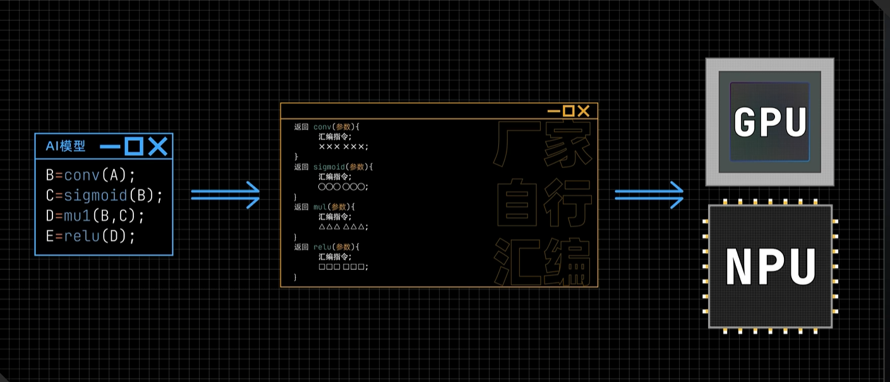

# CPU、GPU、NPU 简要对比

## 一、引言
- **核心问题**：CPU、GPU、NPU 名称仅差一个单词，为何需要分化出多种计算芯片？它们的区别是什么？
- **通俗比喻的局限**：
  - 网上将 CPU 比作“什么都会的博士生（擅长复杂任务）”，GPU 比作“一群小学生（适合同时处理多个简单任务）”，但该比喻未能清晰解释“复杂任务”和“图形计算”的本质。

## 二、CPU 与 GPU 的核心区别
### 1. GPU 的设计逻辑：并行处理简单重复任务
- **图形计算的本质**：
  - 3D 模型由三角形组成，三角形由线条组成，线条通过两个顶点的坐标信息存储，中间部分需实时计算。
  - 计算方式：通过顶点坐标计算斜率和截距，得到线方程，再代入 X 计算每个中间点的 Y 坐标（简单重复的乘法和加法）。
  - 
- **GPU 的优势**：
  - 包含大量计算单元（如英伟达的 CUDA 核心），遵循“单指令多数据”策略，可同时处理多个简单运算，大幅提升效率。
  - 
- **GPU 的局限**：
  - 当任务存在依赖关系（如代码执行依赖上一行结果）时，无法并行计算，只能逐行处理，效率低下。

### 2. CPU 的设计逻辑：高效处理复杂逻辑任务
- **擅长的任务类型**：
  - 以代码分支判断为例：若 A=3，CPU 可直接根据“A<10”的判断结果跳转执行对应代码（如 B=6），仅需一次计算。
  - 核心优势：具备强大的逻辑处理能力，支持分支跳转，适合处理含复杂逻辑的任务。
  - 
- **技术特点**：
  - 发展了“分支预测”功能，核心电路中很大一部分用于优化分支语句处理效率，提升复杂逻辑的执行速度。
  - 

## 三、GPU 的功能扩展与 GPGPU
- **组成部分及功能**：
  - **RT Core**：负责光线追踪，渲染更逼真的游戏画面。
  - **CUDA 核心**：传统功能，负责图形渲染和通用科学计算。
  - **Tensor 核心**：专门用于神经网络加速（矩阵运算），效率高于 CUDA 核心。
- **GPGPU 的定义**：功能不限于图形渲染，向科学计算、AI 等领域扩展的 GPU。

## 四、NPU 的诞生与特点
### 1. 诞生背景
- 为满足仅需 AI 计算、设备小型化（如边缘计算）等需求，专门设计用于神经网络加速的芯片。

### 2. 核心优势
- **硬件级矩阵运算**：内部包含类似 Tensor 核心的计算单元（如华为升腾 NPU 的 Cube Core），可直接进行矩阵运算，效率远超通用计算单元。
  - 示例：华为 Cube Core 支持 16×16 FP16 精度矩阵相乘，或 32×16 INT8 精度矩阵相乘。
- **辅助计算单元**：包含标量和矢量计算单元，解决 AI 推理中的其他计算任务。
- **部署灵活性**：支持云、边、端多种场景（如服务器、嵌入式系统、电脑算力卡），功耗和算力可按需配置，比 GPU 更灵活。

# 比GPU更快！NPU是如何实现AI加速的？

## 核心问题引入
- GPU和NPU均可用于AI计算，二者的本质区别是什么？
- NPU如何从硬件层面实现神经网络加速？

## 一、AI计算的核心：矩阵计算
- **矩阵计算的算力消耗**：以两个4×4矩阵相乘为例，需要进行64次乘法和48次加法运算。
- 
- **共同目标**：GPU和NPU的核心任务都是快速完成矩阵计算中的乘法与加法操作。

## 二、GPU的矩阵计算方式
1. **核心优势**：擅长并行计算，内部包含多个可同时工作的乘加单元。
2. **计算流程（以4×4矩阵第一行计算为例）**：
   - 第一步：数据加载到GPU缓存，控制器从缓存读取数据，同时分配到4个乘法器计算，结果返回缓存（第一条指令）。
   - 第二步：缓存中的中间结果被搬运到2个加法器，计算和后返回缓存（第二条指令）。
   - 第三步：对剩余两个数据进行加法运算，完成计算（第三条指令）。
3. **并行扩展**：将运算器复制15份，可同时对16行算式运算，两个4×4矩阵相乘最多仅需3条指令。

## 三、NPU的加速原理
1. **核心改进**：减少数据搬运时间，在乘法器和加法器之间建立直接通道。
2. **计算流程优化**：
   - 数据从缓存搬运到运算器后（仅需1条指令），中间结果不回流缓存，直接传入下一个加法器。
   - 运算器自动完成全部计算，直接输出最终结果。
   - 
3. **核心思想**：通过硬件层面构建数据流通管道，减少数据在运算器与缓存间的往返搬运，提升效率。

## 四、GPU与NPU的本质区别：灵活性与专用性的取舍
| 维度       | GPU特点                          | NPU特点                          |
|------------|----------------------------------|----------------------------------|
| 计算方式   | 一次计算简单乘加，依赖软件指令组合 | 硬件层面建立固定管道，自动完成流程 |
| 灵活性     | 可构造任意复杂公式，通用性强      | 仅适用于特定公式，专用性强        |
| 效率       | 数据搬运耗时，效率较低            | 减少数据搬运，效率更高            |
| 适用场景   | 多类型复杂计算任务                | 特定AI模型、矩阵计算任务          |

## 五、NPU的硬件细节
- **基本单元**：仍以乘加器为基础，核心差异在于数据流动方式（不回流缓存）。
- **设计多样性**：不同公司的NPU数据流动方式不同（如华为升腾NPU的cube call）。
- 
- **华为升腾NPU示例**：
  - 支持FP16精度的16×16矩阵相乘。
  - 支持INT8精度的32×16矩阵相乘。
  - 

## 总结
- NPU通过硬件层面优化数据流动路径，减少中间结果搬运，实现AI计算加速。
- GPU与NPU的差异本质是通用性与专用性的权衡，无绝对优劣，需根据具体场景选择。
- 广义上两者边界逐渐模糊，现代GPU常集成矩阵运算单元，NPU也向多功能化发展。

# 从英伟达CUDA到昇腾CANN：计算架构的重要性

## 一、计算架构的核心地位
- **定义**：计算架构是让芯片（如GPU、NPU）能够高效运行复杂计算任务的基础，被称为芯片厂商的"护城河"
- **重要性**：正是依靠计算架构，英伟达才能完美抓住区块链、科学计算和AI等多个技术风口
- **适用范围**：不仅英伟达的GPU有计算架构，华为昇腾的NPU也拥有自己的计算架构

## 二、底层计算逻辑基础
- **复杂计算的本质**：区块链、科学计算、AI等技术的底层，本质都是对大量数学公式的计算
- **AI模型的构成**：简化的AI模型代码由一系列复杂函数（如RELU、SIGMOID等）构成，这些函数与sin、cos等三角函数本质相同，都是根据输入计算结果
- **算子概念**：实现这些复杂运算的函数在AI领域被称为"算子"，是AI计算中的核心概念

## 三、计算设备的差异与挑战
1. **CPU的局限**：
   - 仅支持简单的加法和乘法运算
   - 运行复杂AI模型时速度较慢
   - 需要通过专门编写的函数（算子）实现复杂运算
   - 
   - 

2. **GPU与NPU的优势**：
   - 具备并行计算（GPU）或张量计算（NPU）能力
   - 处理特定计算任务时速度远快于CPU
   - 需要针对其底层计算能力重新编写代码

3. **早期编程困境**：
   - 刚开始的时候不存在针对GPU和NPU的编译器
   - 
   - 不同厂家的芯片有各自独特的汇编指令集
   - 
   - 厂家出于保密不愿开放汇编指令集
   - 芯片代码基本由厂家用汇编实现，限制了开发者
   - 
   - 缺乏针对GPU和NPU的高级编程语言和编译器

## 四、计算架构的构成
计算架构 = 高级编程语言 + 编译器 + 配套工具

| 组成部分 | 作用 |
|---------|------|
| 高级编程语言 | 让开发者能方便地为特定芯片编写代码 |
| 编译器 | 如同"翻译"，将高级语言转换为芯片能理解的指令 |
| 基础算子库 | 提供现成的常用算子，简化开发 |
| 辅助工具 | 如图引擎、RUNTIME等，提升开发效率 |

## 五、主流计算架构对比 
| 厂商 | 计算架构 | 编程语言 | 编译器 | 基础算子库 |
|------|---------|---------|--------|-----------|
| 英伟达 | CUDA | C/C++（扩展） | nvcc | cuDNN |
| 华为 | CANN | SC | 毕生 | AOL |

## 六、计算架构的重要意义
1. **技术层面**：
   - 解决了GPU/NPU编程难题
   - 让开发者能自由编写所需算子
   - 充分发挥芯片的计算能力

2. **生态层面**：
   - 降低了开发门槛，吸引更多开发者
   - 形成技术生态，构成厂商的"护城河"
   - 需要厂商投入巨量资源开发和维护

3. **应用层面**：
   - 普通用户：可直接使用算子库满足需求
   - 前沿开发者：可自定义新算子实现创新
   - 推动了AI、科学计算等领域的快速发展

