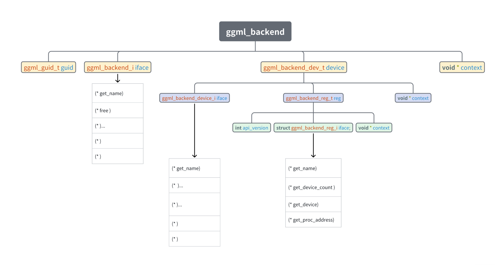

## 学习资料
- 知乎专栏
https://zhuanlan.zhihu.com/c_1835427210485444609

## ggml框架学习

所以如果你想仔细学习llama.cpp的底层原理，花一些时间从简单的[ggml框架](https://zhida.zhihu.com/search?content_id=253016055&content_type=Article&match_order=1&q=ggml%E6%A1%86%E6%9E%B6&zhida_source=entity)开始学习可能是一个更顺滑的学习路径。所以在我们学习llama.cpp的源码之前，先来学习一些ggml框架的基础概念。

  

[GGML项目地址​github.com/ggerganov/ggml](https://link.zhihu.com/?target=https%3A//github.com/ggerganov/ggml)

### 一、**Introduction**

ggml是一个用 C 和 C++ 编写、专注于 [Transformer 架构](https://zhida.zhihu.com/search?content_id=253016055&content_type=Article&match_order=1&q=Transformer+%E6%9E%B6%E6%9E%84&zhida_source=entity)模型推理的机器学习库。该项目完全开源，处于活跃的开发阶段，开发社区也在不断壮大。ggml 和 [PyTorch](https://zhida.zhihu.com/search?content_id=253016055&content_type=Article&match_order=1&q=PyTorch&zhida_source=entity)、[TensorFlow](https://zhida.zhihu.com/search?content_id=253016055&content_type=Article&match_order=1&q=TensorFlow&zhida_source=entity) 等机器学习库比较相似，但由于目前处于开发的早期阶段，一些底层设计仍在不断改进中。  
  
相比于其它库，ggml 有以下优势:  
  
\- 最小化实现: 核心库独立，仅包含 5 个文件。如果你想加入 GPU 支持，你可以自行加入相关实现，这不是必选的。  
  
\- 编译简单: 你不需要花哨的编译工具，如果不需要 GPU，单纯 GGC 或 Clang 就可以完成编译。  
  
\- 轻量化: 编译好的二进制文件还不到 1MB，和 PyTorch (需要几百 MB) 对比实在是够小了。  
  
\- 兼容性好: 支持各类硬件，包括 x86\_64、ARM、Apple Silicon、[CUDA](https://zhida.zhihu.com/search?content_id=253016055&content_type=Article&match_order=1&q=CUDA&zhida_source=entity) 等等。  
  
\- 支持张量的量化: 张量可以被量化，以此节省内存，有些时候甚至还提升了性能。  
\- 内存使用高效到了极致: 存储张量和执行计算的开销是最小化的。  
  
在[Hugging face](https://zhida.zhihu.com/search?content_id=253016055&content_type=Article&match_order=1&q=Hugging+face&zhida_source=entity)上，Georgi Gerganov本人也发布了一篇介绍GGML的帖子。该篇帖子有英文和中文两个版本，里面介绍了GGML的基础术语和概念，并且有简单的源码demo进行分析。  
  
  

[Introduction to GGML​huggingface.co/blog/introduction-to-ggml](https://link.zhihu.com/?target=https%3A//huggingface.co/blog/introduction-to-ggml)

从这篇介绍贴中你能学到什么？

1.  ggml简单demo的编译与运行
2.  ggml基础术语和概念
3.  运行基础的张量tensor乘法的流程

（不过个人感觉里面一些概念的讲解对于初学者而言仍然有些不好理解，所以可以配合下文的讲解一起阅读，进行理解）  

### **二、理解网络推理完整流程**

在阅读了上述“Introduction to GGML”文章后，你会对GGML库中的一些术语和基本概念有所了解。  
  
但是遗憾的是，该文章以及示例的simple-demo只是为了展示一些核心概念，并且对于很多概念的细节并为提及。这可能会导致一些之前未接触过相关领域的初学者看完之后仍然不理解一些概念为什么这样设计。并且demo中的很多函数使用的流程与实际推理神经网络推理/训练的过程有所差异（为了使样例简化）。  
  
所以接下来我将对源仓库中examples/simple/simple-backend 的demo源码进行一定的修改。并且配合代码注释与相关图例来帮助你理解一些核心概念，，使得其调用过程更接近实际项目中网络推理的过程。  
  
在接下来的demo演示与介绍中主要包含以下内容：

1.  **关于ggml核心概念的图解演示**
2.  **更接近原项目中example/mnist手写数字识别的计算流程。**
3.  **一个以ggml作为第三方库的代码模板**
4.  **一个常用的矩阵优化测试代码sgemm**

这里对第3条做一个简单的解释：在原项目中，我们只能在/examples文件夹下进行新建demo，而无法直接将其作为第三方库插入到我们自己的代码。如果想要将ggml作为库函数，需要进行一些cmake配置。所以我将新建一个空白的demo演示仓库，其中演示的代码将ggml以第三方库的形式调用，方便大家后续想在其他C++工程中使用ggml时进行cmake的配置。  
  
教程源码（后续可能添加更多demo）：

[GGML-turorial​github.com/Yangxiaoz/GGML-Tutorial](https://link.zhihu.com/?target=https%3A//github.com/Yangxiaoz/GGML-Tutorial)

下面对源码中的简单demo进行解读：

### **1.样例介绍--sgemm**

[SGEMM](https://zhida.zhihu.com/search?content_id=253016055&content_type=Article&match_order=1&q=SGEMM&zhida_source=entity)（Single-Precision General Matrix Multiply）是 BLAS（Basic Linear Algebra Subprograms）库中的一个常用函数，执行单精度矩阵乘法。常被当作矩阵优化测试样例。  
  
在本例中实现的样例为：

C\=A×B+CC = A \\times B + CC = A \\times B + C

  

### **2\. 定义 mode模型**

首先我们需要根据计算流程创建mode模型对象，对象成员如下：

    struct ggml_tensor * A;
    struct ggml_tensor * B;
    struct ggml_tensor * C;
    // the backend to perform the computation (CPU, CUDA, METAL)
    ggml_backend_t backend = NULL;
    // the backend buffer to storage the tensors data of A、B and C
    ggml_backend_buffer_t buffer;
    // the context to define the tensor information (dimensions, size, memory address)
    struct ggml_context * ctx;
    // the compute graph (which is piont to a static variable of func, so no need to free )
    struct ggml_cgraph * gf;
    

  

可以看到，模型对象中有计算所需的tensor、计算的后端backend、还有后端对应的buffer、上下文ctx等等。而理解这个model模型的成员分别都有什么含义后，再看其他源码就会非常轻松。

接下来我们进行逐一介绍：

### 3\. **ggml\_tensor介绍**

对于ggml的tensor张量部分，与现在主流框架pytroch等概念相似。其中  
tensor结构体中有几个变量值得注意：  
  

    int64_t ne[GGML_MAX_DIMS]; // tensor 的维度
    size_t nb[GGML_MAX_DIMS]; // tensor不同维度元素实际存储地址的间距步长：stride in bytes:
                                       // nb[0] = ggml_type_size(type)
                                       // nb[1] = nb[0]   * (ne[0] / ggml_blck_size(type)) + padding
                                       // nb[i] = nb[i-1] * ne[i-1]
            // 该tensor是否为算子结果（如add、mul_mat...）
     enum ggml_op op;
            //如果该tensor是某个算子的结果，那么计算时所需的源数据
     struct ggml_tensor * src[GGML_MAX_SRC];
            // 若该tensor是其他tensor的引用（即只是名字不同，实际上指向同一块数据）时
            //引用的目标tensor指针为view_src：
     struct ggml_tensor * view_src;
     size_t               view_offs;
            //tensor实际存储数据的地址指针
     void * data;
            //tensor名字
     char name[GGML_MAX_NAME];
    

  
值的注意的是tensor中的buffer指向的是能够操作该张量对应的数据块的接口！而实际tensor对应的数据存储的地址为“data”指针指向的位置。  
  
所以，tensor结构体内本身是没有存储任何真实数据的！（即无论tensor数据有多大，ggml\_tensor结构体自身占用的空间是固定的）

  

### 4\. **buffer介绍**

如果在接触ggml之前没有接触过类似的项目时，最令人困惑的概念之一便是buffer。这个概念翻译为中文后总感觉不对味。故此在这里对buffer概念作出解释：  
  
在ggml框架中，一切数据（context、dataset、tensor、weight...）都应该被存放在buffer中。而之所以要用buffer进行集成，承载不同数据，是为了便于实现多种后端（CPU、GPU）设备内存的统一管理。也就是说，buffer是实现不同类型数据在多种类型后端上进行**统一的接口对象**。如下图所示。

  

### 5\. C**ontext介绍**

context，又是一个翻译为中文后令人困惑的概念，我一直觉得“上下文”这个翻译无法体现该词的真实含义。而在ggml中，会出现各种context为名称的不同变量。我认为在此框架中，context应该翻译为：“环境信息”。可以类比操作系统的“环境变量”：针对不同的程序，你可能需要不同的环境变量来启动运行程序。  
  
对于ggml框架来说，无论你要做什么（建立modle模型、建立计算图、还是创建承载计算结果的result）都需要先创建一个context作为容器，而你所创建的任何信息结构体（tensor、graph..）实际都存储在context容器包含的地址空间内。

### **让我们以ggml\_context为例:**

ggml\_context是一个用于管理ggml框架推理时使用的各种高级对象信息的容器。容器里可以承载的数据有三种类型：Tensor、Graph、Work\_buffer。并且使用ggml\_object结构体将容器内的数据连接，实现链表。内部结构如下图所示：

在容器中几个比较重要的成员如下：  

*   mem\_size：ggml\_context所维护的容器长度（注意不是ggml\_context的长度）  
    
*   mem\_buffer: ggml\_contexts所维护的容器首地址。（之前说过，ggml中一切数据都要放在buffer里，所以这里context维护的容器也需要放在buffer里）
*   n\_object: 容器内的数据对象的个数
*   object\_begin:容器内第一个数据链表节点
*   object\_end:容器内最后一个数据链表节点  
      
    Note：**第二次重复！你需要牢记，ggml\_context容器所承载的无论是tensor还是graph，都不是实际的数据本身，而是用来描述他们的结构体对象。实际的数据可以通过这些描述对象为索引，进行访问**

### **6\. backend介绍**

GGML的后端backend有如下几个比较重要的概念：  
① ggml\_backend ：执行计算图的接口，有很多种类型: CPU (默认) 、CUDA、[Metal](https://zhida.zhihu.com/search?content_id=253016055&content_type=Article&match_order=1&q=Metal&zhida_source=entity) (Apple Silicon) 、[Vulkan](https://zhida.zhihu.com/search?content_id=253016055&content_type=Article&match_order=1&q=Vulkan&zhida_source=entity) 等等  
  
② ggml\_backend\_buffer：表示通过应后端backend通过分配的内存空间。需要注意的是，一个缓存可以存储多个张量数据。  
  
③ ggml\_backend\_sched：一个调度器，使得多种后端可以并发使用，在处理大模型或多 GPU 推理时，实现跨硬件平台地分配计算任务 (如 CPU 加 GPU 混合计算)。该调度器还能自动将 GPU 不支持的算子转移到 CPU 上，来确保最优的资源利用和兼容性。（但是在本次代码中并未使用）  
  
这里，具体的后端细节与后端调度器内容过多，不再追述。后续可能单开一期进行讲解。

### **7\. cgraph计算图介绍**

我们知道，现在的绝大部分神经网络都可以看作一个有向无环的“计算图”。而后续实际的计算，则是通过遍历该图上的节点来进行推理的。  
  
在本次样例中，根据tensor之间关系构建的计算图如下：

在图中，分为两种类型的元素： node（白）和leaf（红）。一切即不是参数（weight）也不是操作数（即tensor结构体中的op为None）的元素称之为leaf，其余都作为node。  
  
这里可以看到，图中最后一个节点node有（view标识），结合之前对tensor的讲解我们可以知道，这个节点是一个对原节点（C矩阵tensor）的引用。即将结果（AB +C）直接存储在C矩阵tensor中，而不是重新建立一个新的tensor来进行存储。

### **8\. gallocr图内存分配器**

我们需要明确，图graph是根据我们ctx中的tensor之间关系进行建立的。而graph中可能包含着输入数据、权重、新建的node节点。而这些都只是数据的描述信息，并不是数据本身。所以我们需要有一个专用的内存分配器来对我们计算图graph中所需要使用的全部数据进行内存分配。  
  
而有的数据（例如参数）可能在load\_mode加载模型时就已经分配好了对应后端的内存buffer，但我们无需担心，gallocr会确认对应tensor是否以及被分配了buffer,如果已经有了，则会直接跳过。  
  
  
以上便是我们所设计的 simple\_model对象的成员详解。如果你对这些概念有了清晰的认识，那么在看后续代码则会感觉非常轻松。  
  
而关于simple\_model对象，还有对应的构造函数和析构函数，具体细节可以自行查阅代码，这里不做过多赘述。

  

### **9\. main函数流程简述**

1.  初始化模型model
2.  加载model中的数据tensor、权重（本例中没有）。
3.  构建计算图graph。
4.  为计算图graph中所有节点分配对应后端内存。
5.  执行计算

实际代码如下：

    //构造simple_model结构体并加载矩阵A、B、C数据
    simple_model model = load_model(matrix_A, matrix_B, matrix_C, sgemm_M, sgemm_K, sgemm_N, backend);
    
    // 建立计算图graph并分配对应后端backend内存
    ggml_gallocr_t allocr = NULL;
    {
        //初始化图分配器gallocr
        allocr = ggml_gallocr_new(ggml_backend_get_default_buffer_type(model.backend));
    
        // Build graphs based on tensor relationships
        model.gf = build_graph(model);
        //根据gf图计算所需空间，进行内存空间预留
        ggml_gallocr_reserve(allocr, model.gf);
        }
    // 执行计算
    struct ggml_tensor * result = compute(model, allocr);
    

* * *

在这个demo中，大致演示了一个相对完整的计算过程。但实际的神经网络推理过程还有模型权重加载、后端调度期backend\_shcedul相关等流程。  
  
到了这里，再回过头看llama.cpp的源码代码，就会轻松很多。但如果你仍然觉得llama.cpp的源码不好理解，或者你想了解如何使用ggml进行网络训练和推理。可以学习ggml项目中/example/mnist手写数字识别demo。

  
  
本人也对这个mnist手写数字识别的demo进行了详细的学习，并且总结了该demo的整体框架思维导图：  

  
导图细节与如何遍历计算图等内容见链接，大家有兴趣的可以结合源码自行学习理解：

[Mnist\_net 源码流程图​n02lxruxa4.feishu.cn/wiki/HPGjwT7FAiyZttkNCErcl7lXnKg?from=from\_copylink](https://link.zhihu.com/?target=https%3A//n02lxruxa4.feishu.cn/wiki/HPGjwT7FAiyZttkNCErcl7lXnKg%3Ffrom%3Dfrom_copylink)

  
### 10. minist思维导图

### 11. ggml后端
GGML对于backend设备实现的大概思想是：先使用ggml_backend_reg注册对象注册device设备，然后再根据device设备绑定对应backend后端对象（之所以说这一点是因为我们看代码的时候一般都是按照backend->device->register的顺序理解的，但这和实际ggml的调用顺序是相反的）

## llama整体流程

_本篇文章将会对llama.cpp在推理时的流程进行总览介绍，关于llama.cpp的概念介绍与[GGML](https://zhida.zhihu.com/search?content_id=254177082&content_type=Article&match_order=1&q=GGML&zhida_source=entity)（llama.cpp框架使用的张量计算库）的相关内容见往期文章。_

*   为何需要流程总览？

首先，llama.cpp这样使用C++的推理框架与[vllm](https://zhida.zhihu.com/search?content_id=254177082&content_type=Article&match_order=1&q=vllm&zhida_source=entity)、[transformers](https://zhida.zhihu.com/search?content_id=254177082&content_type=Article&match_order=1&q=transformers&zhida_source=entity)这样基于python实现的框架最大的区别是，很多功能在实现上会比较复杂抽象。好处是你可以了解到框架内的任何机制（内存映射mmap、[backend](https://zhida.zhihu.com/search?content_id=254177082&content_type=Article&match_order=1&q=backend&zhida_source=entity)后端调度）的具体实现。而坏处是可能对于初学者来说信息过于混杂，使得我们常常在“精细阅读”时，面对很多陌生的变量而难以理解。

所以我们需要先清楚大概的框架，才能快速找到自己感兴趣的"部分"位于代码流程的哪里。（我在最开始接触llamacpp时，找了半天没找到在哪里进行attention算计过程的定义 0.0

并且时至今日，llama.cpp仍然每天都在Commits更新、变动。所以理解llama.cpp推理的流程框架与核心思想变的至关重要。因为很有可能你过去纠结的细节点在不久的将来会被更新、迭代。

  

### 一、核心概念

  

在阅读llama.cpp之前，有一些核心名词是必须要清楚的：[tensor](https://zhida.zhihu.com/search?content_id=254177082&content_type=Article&match_order=1&q=tensor&zhida_source=entity)、[buffer](https://zhida.zhihu.com/search?content_id=254177082&content_type=Article&match_order=1&q=buffer&zhida_source=entity)、[ctx](https://zhida.zhihu.com/search?content_id=254177082&content_type=Article&match_order=1&q=ctx&zhida_source=entity) 、backend、cgraph。这些基础概念是llama.cpp推理运行的关键。如果你对他们还不熟悉，请看上一期关于ggml框架的介绍进行了解。

接下来我们需要了解几个关键思想：

#### 1\. tensor、cgraph是数据的信息列表

什么是信息列表？就是只描述对应的数据长什么样、名字是什么、实际存储的首地址指针...等等之类的信息，而不存储数据本身。

即当我们加载完权重参数后得到的tensor、通过构建graph得到的cgraph，都只是用来描述数据信息与数据之间关系的结构体。而实际数据的存储位置是由sched调度器与backend buffer后端缓冲所管理存放的。

而这些tensor、graph作为描述信息的列表，本身也需要空间进行存储。所以ctx （context）设计应运而生：即存储这些列表信息的容器。

所以在后续的计算中，我们只需要拿到ctx，就能拿到所有的信息列表，然后经过查找，就可以得到实际数据的存储指针、数据类型等信息。

  

#### 2\. 先分配、后计算

  

llama.cpp在进行实际计算时，需要对过程中所有可能用到的数据、信息提前分配内存。从而在实际推理计算过程中，做到“0”内存分配（虽然使用mmap之后，在运行最初阶段。计算时仍然会触发read来加载缺页）。

这意味着你需要在计算前进行最坏情况的演算、提前分配所需要的最大内存（比如llm推理时的上下文长度为2k时）你需要提前将2k的[kv cache](https://zhida.zhihu.com/search?content_id=254177082&content_type=Article&match_order=1&q=kv+cache&zhida_source=entity)等分配好，而不能在运行中途增加对应的内存。这样设计的原因是在运行过程中，malloc等向操作系统申请内存分配函数的计算开销太大，应该尽可能减少这种开销。

也正是这种先分配、后计算的特点，使得你会看到在推理过程中出现了多次[llama\_build\_graph()](https://zhida.zhihu.com/search?content_id=254177082&content_type=Article&match_order=1&q=llama_build_graph%28%29&zhida_source=entity)计算图的重复构建。（具体细节在下面流程介绍讲）

  

  

#### 二、推理流程总览

  

下图是关于llama.cpp/examples/simple: [Code Link](https://link.zhihu.com/?target=https%3A//github.com/ggml-org/llama.cpp/tree/master/examples/simple)

simple例程省去了很多不必要的功能，保留了最核心的步骤，是我们初步学习的最佳选择。

在整个流程中，我们主要讲解黄色框框对应的三个部分，并不是说其他部分就不重要了，只是因为其他部分功能相对比较简单（or 单一）故如果感兴趣可以自行查阅源码进行了解。

#### 1\. model初始化

这一部分主要是根据GGUF文件提取模型信息、加载权重参数等过程。

下图是llama.cpp官方对gguf文件作出的解释，原文链接：[Link](https://link.zhihu.com/?target=https%3A//github.com/ggml-org/ggml/blob/master/docs/gguf.md)

  

我们可以看到，在文件中最前方的黑色部分数据是用于描述GGUF文件信息的数据。

而黑色数据后方的绿色部分数据称之为metadata，元数据（和meta公司没关系0.0）。元数据中不仅包含了目标模型的架构（如：deepseekv3）、模型超参数（如一共多少层、每层的hidden\_dim..）以及权重tensor的信息等等。

元数据在llama.cpp中通常使用哈希键值对（kv pairs）的形式存储，（和llm中的kv cache没关系）

所以当我们通过kv pairs将metadata元数据读取之后，便可以通过metadata读取后续的权重tensor数据了。

而在将权重tensor加载进内存前，需要先检查所有后端设备、并且根据超参数[hparams](https://zhida.zhihu.com/search?content_id=254177082&content_type=Article&match_order=1&q=hparams&zhida_source=entity)判断是否要split切割模型到不同的后端（比如前10层在CPU\_buffer、后20层在GPU\_buffer）。确认并配置好对应的backend之后，便可以将tensor加载至目标后端的buffer了。

  

#### 2\. context初始化

我们在之前说过，context是承载信息列表（tensor、graph的容器），并且我们不能在计算时动态分配内存，需要提前分配好。所以在正式计算前，我们需要将后续计算所需要的所有tensor、graph都推算一遍，然后init初始化所需要的空白buffer，以供后续计算时使用。

从图中可以看到，在这一阶段，重点包含以下几个buffer的init

*   kv cache buffer init ：需要提前根据超参数hparams确认kv cache最大使用情况，然后分配对应buffer
*   graph output buffer: 我们知道运行llm时，除了模型权重、运行时产生的kv cache之外，在最后还有输出的结果也是不确定的，所以我们还需要根据需求确认最后模型输出可能使用的最大buffer。
*   sheduler init: 由于调度器本身可能在多个后端都保存有副本，所以这里需要确认调度器的参数、配置，为调度器分配最坏情况的buffer
*   cgrpah init： 这里需要注意，想要确认计算图的内存空间大小，就必须先构建计算图。所以在这里作者使用了llama\_build\_graph()来对整体的计算图进行了构建。而对于一个llm模型来说，**其Attention算子内部、FFN等计算的逻辑关系就是在这个函数中进行构建的**。所以想要了解llama.cpp中如何实现例如Moe、MLA等方法是如何实现的，仅需查看该步骤中的llama\_build\_graph()构建过程即可。

然而需要注意的是，在前面也说到了，虽然在ctx init这一步骤中，使用了**llama\_build\_graph()**函数对目标架构的llm内部算子关系进行了计算图的构建，但构建的graph是用来评估计算是最坏情况使用的内存情况的，并不会在后续计算中使用该graph。所以在后续实际计算中，你会看到使用了一模一样的“**llama\_build\_graph()**”函数又对模型进行了计算图的构建。

  

#### 3\. main loop 遍历计算图，进行计算

  

在经过前面的步骤中，我们加载了模型model、加载了相关的超参数hparams，还为计算中的一切预留了足够的buffer空间，那么一切准备就绪之后，便可以开始进行计算了！

在这一过程中，大致可以分为上图中的四个步骤：

*   为当前批次batch进行准备工作
*   构建计算图cgraph
*   为graph分配对应后端buffer
*   遍历图，进行计算
*   输出结果处理

更细节的流程如下图（仍然隐藏了部分细节）：

  

#### 总结

  

以上便是llama.cpp对llm进行一次推理的大致流程。当然其中很多细节仍然未涉及（例如模型参数的量化、推理的采样、KV cache管理、如何利用sched调度器进行多backend buffer的分配管理、如何遍历计算图、如何使用多线程、Cuda.....）

  

### 一、例程说明

为了更好的理解上述机制，本文将使用llama.cpp的推理流程范式来实现一个自定义的简单矩阵乘法、加法例程，，并且使用CPU+GPU两种后端进行混合推理。（之所以不直接对llama.cpp下的examples/simple例程进行讲解分析的原因是，现在的llm模型中权重数量过多，随便一个模型在构建graph之后就能达到上千个node。所以对着上千个node进行逐行debug调试理解显然会造成一定的麻烦）。本次例程核心框架描述如下：

可以看到，在整个过程中，我们将有4个权重weight参数，并利用这4个weight对一个输入input向量进行两次的矩阵乘法和加法操作。

并且我们希望第一次的矩阵乘法、加法操作在CPU上进行，而第二次的操作在GPU上进行，最终实现多后端backend的混合推理流程。

### 二、流程解析

### 1.load\_tensor 读取模型权重

在llama.cpp进行推理时，除了注册、加载后端设备之外，首先要做的就是从.gguf文件中读取模型信息和模型权重参数。具体如何提取.gguf文件中的模型信息等读者可以自行查看源码。在这里只需要知道，在加载完毕.gguf文件之后，我们得到了一个 **llama\_model \* model** ; 对象，而该对象中的layers向量成员中，保存了每一层的权重weight tensor列表

    struct llama_model {
        ...
    std::vector<llama_layer> layers;
        ...
    }
    

其中llama\_layer结构体内容如下：

    struct llama_layer {
        // normalization
        struct ggml_tensor * attn_norm       = nullptr;
        struct ggml_tensor * attn_norm_b     = nullptr;
        struct ggml_tensor * attn_norm_2     = nullptr;
        ...
        ...
    }
    

所以，按照这个流程思想，对于我们的例程来说，在加载完毕.gguf文件之后，我们有的只是一系列的weight tensor列表,如下图所示：

  

(这里对ggml中的概念做一个简单复习：ggml\_context是一个容器，其可以容纳ggml中不同类型的各种结构，如：tensor、graph等。 ggml\_tensor只是weight的描述对象，其描述了weight的信息和实际weight存放指针\*.data、访问接口.iface等。 实际weight存放与不同backend buffer中。还是不理解的可以回看文章：([ggml框架](https://zhuanlan.zhihu.com/p/19968327329))

在这一流程中，实际llama.cpp在模型加载权重参数时，会根据 **model\_params.n\_gpu\_layers = ngl;** 参数来将对应层数layer的参数加载到不同的backend。

（ngl指的是模型中offload卸载到GPU的前ngl层。例如一个模型有27层，而当传入参数ngl=10时，llama.cpp就会将模型的前10层权重weight加载到 GPU cuda\_buffer,剩余的weight加载到cpu\_buffer。

只不过在本次例程中，为了方便，将前两个weight加载至CPU backend，后两个weight加载至GPU backend。

### 2\. build\_graph：计算图构建

在llama.cpp中，构建计算图graph有两个步骤： 1. 使用算子函数连接weight参数、创建中间计算节点 2. 使用ggml\_build\_forward\_expand()函数构建计算图

例程代码如下所示：

    ggml_tensor * cur;
     // C = mut_mat(A,B) == B(A.T)
     //step 1: link weight and create temp compute node
     cur = ggml_mul_mat(ctx, weight_0_mm, inp);
     ggml_set_name(cur, "mul_mat_0");
    
     cur = ggml_add(ctx,cur,weight_1_add);
     ggml_set_name(cur, "add_1");
    
     cur = ggml_mul_mat(ctx, weight_2_mm, cur);
     ggml_set_name(cur, "mul_mat_2");
    
     cur = ggml_add(ctx,cur,weight_3_add);
     ggml_set_name(cur, "add_3");
    
     //step 2: build the graph
     ggml_build_forward_expand(gf, cur);
    

接下来我们对这两个步骤进行详细解释：

*   step 1: link tensor

首先在经过第一个步骤之后，我们将会得到如下tensor连接关系图。注意，此时并没有构造graph之类的结构记录下图所示的拓扑结构关系。tensor之间的连接关系是依靠ggml\_tensor结构体中的src指针所记录。

    struct ggml_tensor {
            ...
            // compute data
            enum ggml_op op;
            ...
            struct ggml_tensor * src[GGML_MAX_SRC];
            ....
        };
    

  

我们可以看到,经过我们手动使用ggml\_mul\_mat、ggml\_add之类的算子函数对tensor进行连接后，会产生一些中间节点tensor（上图中黄色的块块）。值得注意的是。这些由算子连接函数产生的中间计算tensor在此时并没有被分配对应的后端backend buffer，这部分tensor的backend buffer将在sched调度器split分割子图时进行动态分配。

*   step 2: build graph

在经过step1之后，我们已经将所有的weight以及中间计算tensor通过src指针连接了起来。接下来便是使用ggml\_build\_forward\_expand()进行cgraph计算图的构建了。

而在构建cgraph计算图之前,我们需要先了解一下ggml\_cgraph结构体中的成员的含义都是什么，下面是ggml\_cgraph的源码实现：

    struct ggml_cgraph {
        int size;    // maximum number of nodes/leafs/grads/grad_accs
        int n_nodes; // number of nodes currently in use
        int n_leafs; // number of leafs currently in use
    
        struct ggml_tensor ** nodes;     // tensors with data that can change if the graph is evaluated
        struct ggml_tensor ** grads;     // the outputs of these tensors are the gradients of the nodes
        struct ggml_tensor ** grad_accs; // accumulators for node gradients
        struct ggml_tensor ** leafs;     // tensors with constant data
    
        struct ggml_hash_set visited_hash_set;
    
        enum ggml_cgraph_eval_order order;
    };
    

_这里我们先忽略**grads**和**grad\_accs**这两个成员，因为这两个成员主要是用来做反向传播求梯度时使用的，而本文主要讨论推理过程。_

我们可以看到，对于ggml\_cgraph来说，最主要的就是**nodes和leafs,**两个由ggml\_tensor\* 构成的数组。顾名思义其其分别代表计算图的节点nodes数组和枝叶leafs数组。“**visited\_hash\_set**”成员则是用来记录计算图graph中已经包含的tensor信息，防止在后续拓展计算图时，重复添加同样的tensor。“**order**”则是用来记录该graph在建立时，是遵循从左到右的图遍历顺序还是从右到左的图遍历顺序。（在本文以及llama.cpp中，默认使用从左到右的图遍历顺序）

接下来我们来看一看ggml\_build\_forward\_expand(ggml\_cgraph \*gf,ggml\_tensor \* result)函数是如何通过tensor之间的关系来进行graph图构建的：

首先该函数用作计算图扩展，即使是第一次调用，也需要传入一个空的gf指针，使得该函数在这个空的gf指针上进行graph图扩展。 对于第二个参数result，应该为你上一个步骤 "**link tensor**"连接之后的最后一个tensor。对于本例程来说，该result应该为第二次add加法计算后的结果，也就是“**add\_1**” tensor。而**ggml\_build\_forward\_expand**函数进行图构建的过程如下图所示(该函数在图遍历构建计算图graph时采用了递归的方法进行遍历，所以直接看代码进行理解可能会较为困难，故将借助下图来解释整个过程)：

  

接下来我将逐步解释上图的graph构建过程:

首先，带有数字的红色圆圈代表了在构建过程中，对tensor的访问顺序。按照之前所说，我们传入的参数result是之前步骤中的最后一个计算tensor，也就是“**add\_1**”,所以当调用“**ggml\_build\_forward\_expand（）**”函数后，第一个访问的tensor便是“**add\_1**”。 紧接着，由于我们默认在图遍历时采用从左向右的顺序进行遍历访问，所以第二个递归访问的tensor便是“**add\_1**”的左源操作数，也就是src\[0\]:"**mul\_mat\_1**"。第三个递归访问“weight\_2\_mm”权重tensor。

那么，什么时候停止？：当当前访问的tensor的src全部被访问之后（或者src == NULL，也就是没有源操作数时），停止递归访问，进行return返回。不过在return返回之前，需要对当前的tensor进行判断，判断其为node节点还是leaf枝叶节点，并将其push进对应的数组

一般地，当当前tensor 的 “op”== NULL时，也就是当该tensor不需要进行计算时认为它是leaf枝叶节点，其余的需要计算的tensor都认为是node节点。（为什么要说“一般地”呢？因为当你需要反向传播时，即便是 op ==NULL 的权重tensor，也需要参与计算“反向传播” ，所以当你需要反向传播是，你需要手动标记当前tensor->flags为“GGML\_TENSOR\_FLAG\_PARAM”，此时除了input和output之外的所有tensor，都会被当作node节点）

所以，当我们访问到第三个tensor，也就是“**weight\_2\_mm**”时，会因为没有src源操作数可以访问而结束当前分支的递归，并且由于该tensor属于leafs，将其压入gf.leafs数组，此时，我们的gf中的第一个枝叶leasf\[0\]就成功诞生了。

在“**weight\_2\_mm**”tensor返回后，继续递归访问“**mul\_mat\_1**”的右源操作数，也就是mul\_mat\_1->src\[1\]。此时，我们便访问到了第四个tensor“add\_0”。

由于我们的神经网络都可以看作有向无环图，所以按照这样的方法一定能够遍历所有tensor。并且由于“递归return时添加node节点的特性”，使得对于我们的 **nodes** 数组来说，id索引号大的tensor在计算时，一定只会依赖于id号比它小的tensor。所以我们在后续的图遍历计算时，只需要按照数组id索引，**从0到n依次进行线性遍历，就能完成对整个计算图的计算。** 所以与其称gf为计算图，我认为不如称其为“**节点数组**”更为贴切。

*   多次调用ggml\_build\_forward\_expand实现计算图拓展:

在llama.cpp对于实际的网络进行图构建时，往往不会一次性将所有权重weight进行link连接之后，仅使用一次ggml\_build\_forward\_expand()对完整的graph图进行构建。而是每次link连接一小部分，然后不断使用ggml\_build\_forward\_expand函数对graph进行扩展。例如当你想给你的网络添加一个分支，你不必修改之前的代码，只需要对新的结果result\_tensor调用一次ggml\_build\_forward\_expand()即可实现计算图graph的扩充，如下所示：

  

可以看到，当递归遍历到第四个tensor时，由于该tensor在之前已经被访问（加入graph），所以会立即return，终止递归。这一快速检查是否被访问的功能便是通过之前所说的cgraph结构体中的“**struct ggml\_hash\_set visited\_hash\_set;**”哈希表映射来实现的。

### build\_graph小结：

至此，我们完成了llama.cpp中将模型model信息从.gguf权重文件到cgraph计算图转化的过程，如下所示：

  

所以现在，理论上我们只需要对这个线性数组gf进行线性的遍历计算，就可以完成一次网络的推理。但此时你需要清楚，这个线性数组gf中的nodes\[\]数组中的节点都还没有被分配对应的backend后端以及backend buffer，因为他们是在link连接时产生的tensor。而不像weight\_tensor是在model加载时，就已经确定其对应的backend、buffer了。

对于nodes\[\]计算节点来说，当输入batch变化、输入序列长度等变化时，这些计算节点所需要的内存等计算资源会动态发生变化。并且当你拥有多个backend后端设备时，你需要调度这些异构的计算设备来处理这个线性nodes\[\]节点队列，使得其能最大化“并发”。所以，为了能够动态、合理地分配nodes\[\]数组中tensor所占用的各种内存、计算等资源，便需要借助**ggml\_backend\_sched**调度器来实现。

那么，接下来让我们一起了解一下与**ggml\_backend\_sched**调度器相关的机制和概念吧！

### ggml\_backend\_sched对象浅析：

首先，我们可以来看一看**ggml\_backend\_sched**对象中，都有哪些成员：（这里大家大致浏览一遍有个印象即可，具体每个成员变量是用来做什么的，会在后续结合例程来解释。）

    struct ggml_backend_sched {
        bool is_reset;            // 是否被重制
        bool is_alloc;            //  是否进行了图分配内存
    
        int n_backends;                                              //运行时，可用的后端数
        ggml_backend_t backends[GGML_SCHED_MAX_BACKENDS];            //后端列表
        ggml_backend_buffer_type_t bufts[GGML_SCHED_MAX_BACKENDS];   //后端buffer列表
        ggml_gallocr_t galloc;                                       //图内存分配器
    
        // 映射graph中的节点的哈希表
        struct ggml_hash_set  hash_set;
        int                 * hv_tensor_backend_ids; // [hash_set.size]
        struct ggml_tensor ** hv_tensor_copies;      // [hash_set.size][n_backends][n_copies]
    
        // 节点对应backend索引
        int * node_backend_ids; // [graph_size]
        int * leaf_backend_ids; // [graph_size]
        //上一次运行索引记录
        int * prev_node_backend_ids; // [graph_size]
        int * prev_leaf_backend_ids; // [graph_size]
    
        //cgraph以及split子图分割相关
        // copy of the graph with modified inputs
        struct ggml_cgraph graph;
        // graph splits
        struct ggml_backend_sched_split * splits;
        int n_splits;
        int splits_capacity;
    
        // 用于支持流水pipline并行相关副本id索引
        int n_copies;
        int cur_copy;
    
        //记录子图执行的事件
        ggml_backend_event_t events[GGML_SCHED_MAX_BACKENDS][GGML_SCHED_MAX_COPIES];
        //总graph输入
        struct ggml_tensor * graph_inputs[GGML_SCHED_MAX_SPLIT_INPUTS];
        int n_graph_inputs;
        struct ggml_context * ctx;
    
        //用户自定义函数接口
        ggml_backend_sched_eval_callback callback_eval;
        void * callback_eval_user_data;
    
        char * context_buffer;
        size_t context_buffer_size;
    
        int debug;
    };
    

对于sched结构中的hash哈希映射表，我们可以大致理解为，它是一个将cgraph计算图中的每个“tensor”与“backend后端”进行连接的桥梁。在后续推理过程中，我们只需要拿到一个“tensor”便可以通过hash表直接查找到对应的“backend\_id”。从而实现了每个tensor与其对应的“backend后端的绑定”。

或许这里会有读者感到疑惑，既然每个tensor结构内部都有其对应的backend buffer，那在runtime运行时，为什么还需要绑定“backend\_id”？实际上backend buffer和backend并不一定是一致的，比如很多嵌入式设备或者nvidia 的jeson系列板卡，其GPU加速器是与CPU共享同一个内存的，所有这是会出现同样一个backend buffer上，可以运行两种类型的backend设备的情况。

  

*   用户接口说明

在sched的成员中，还有有两个成员需要在这里做一个特别说明，那就是用户自定义接口：

    //用户自定义函数接口
    ggml_backend_sched_eval_callback callback_eval;
    void * callback_eval_user_data;
    

这个函数是作者为开发者用户预留的接口，用于在后续计算graph时观察任何你想要观察的tensor状态、数值。比方说，如果你现在设计了一个新的[Attention算子](https://zhida.zhihu.com/search?content_id=256257064&content_type=Article&match_order=1&q=Attention%E7%AE%97%E5%AD%90&zhida_source=entity)，并将其整合到了一个llm当中，现在你想要观察每一层中attention算子输出的结果是什么样的。这时你便可以使用该接口，来进行观察。

其中， **callback\_eval\_user\_data()**函数的内部逻辑由用户自己定义。当其被定义，即**sched.callback\_eval**指针不为null时，ggml在每次执行一个graph的node之前，都会调用该 **callback\_eval\_user\_data**函数来询问是否需要观察该node节点。当该函数返回true时，表面用户想要访问该node节点。则会在执行完毕该节点之后，再次调用该函数，来让用户提取该node节点中的信息。具体更细节的问题读者可以自行查阅源码，这里不做过多的赘述了。

*   继续推理流程：

在这里，我们需要明确，此时我们有的只是一个cgraph计算图，并且该计算图中的很多节点还没有被分配内存。所以为了能够进行最终的compute计算，我们还需要将cgraph进行内存、后端的绑定以及子图的分割（因为我们想让graph图中前半部分在CPU中执行，后半部分在GPU中执行，显然需要将先前的完整graph图分割为CPU子图和GPU子图）

而 **ggml\_backend\_sched\_alloc\_graph()** 函数便是用来解决上述问题的。该函数内部有两个函数：1.split子图分割函数 2. split子图backend分配函数。如下所示：

    bool ggml_backend_sched_alloc_graph(ggml_backend_sched_t sched, struct ggml_cgraph * graph) {
        GGML_ASSERT((int)sched->hash_set.size >= graph->n_nodes + graph->n_leafs);
        //子图分割
        ggml_backend_sched_split_graph(sched, graph);
        //分割后的子图alloc
        if (!ggml_backend_sched_alloc_splits(sched)) {
            return false;
        }
        sched->is_alloc = true;
        return true;
    }
    

我们首先介绍 ggml\_backend\_sched\_split\_graph()子图分割函数：

### split子图分割

在这一步骤中，该函数干了两件事： 1. 为之前构建的cgraph中的每一个tensor（nodes和leafs） 绑定对应的backend后端 2.根据cgraph中的nodes节点绑定的的backend\_id后端进行子图分割。

以上两件事在代码中体现为五个step步骤：

1.  遍历cgraph中的所有tensor，使用sched中的哈希映射结构来配对保存每个tensor和对应的backend\_id（跳过view\_tensor）
2.  扩展绑定上一个步骤中，因未分配到合适的backend\_id的tensor（跳过view\_tensor）
3.  检查是否有可以进行backend后端升级的tensor（例如某个tensor既可以在cpu中也可以在gpu中时，便将其升级的gpu中）
4.  根据dst和view\_src分配剩余未分配的的src节点（view\_tensor等）
5.  进行split子图分割

接下来我们将通过例程来展示上述的过程：

### ①遍历tensor，绑定backend\_id

在这一个步骤中，我们需要先对leafs枝叶节点进行遍历，再对nodes节点进行遍历。这是因为leafs枝叶节点已经被分配了对应的backend和buffer，此时使用函数：“**ggml\_backend\_sched\_backend\_id\_from\_cur(sched, leaf)**”时，该函数可以直接根据backend\_buffer来获取对应的backend\_id。分配结果如下图所示：

  

这里需要注意，input\_tensor也属于leafs节点，但它与其他的weight\_tensor的绑定逻辑不同，因为它并没有被事先分配相应的backend buffer。事实上ggml\_backend\_sched\_backend\_id\_from\_cur函数在绑定时会判断当前tensor是否为input输入tensor，如果是，则强制绑定至CPU对应的backend\_id。

至此，所有的leafs枝叶节点tensor都已经绑定了相对应的backend\_id。接下来我们需要遍历nodes节点。

对于nodes节点来说，其仍然使用相同的函数“**ggml\_backend\_sched\_backend\_id\_from\_cur()**”来进行绑定。但是由于nodes节点们都没有被事先分配相应的backend\_buffer，所以该函数会先判断当前tensor是否为input输入，如果不是，则根据当前tensor的src源操作数中的weight参数tensor来分配backend\_id。简言之就是该tensor的输入参数使用哪个backend，它就使用哪个backend。过程如下图所示：

  

至此，我们就给cgraph中的所有tensor都分配了对应的backend\_id。而每个tensor与对应的backend\_id之间的映射关系，则由sched中的hash哈希映射表进行维护。在后续compute计算过程中，可以根据tensor作为键值来直接获取到对应的backend\_id.

由于本例程比较简单，在计算图中并没有view\_tensor（视图tensor）等结构，所以无法体现前面所说的5个步骤中的2-4步骤。读者可以仔细查阅源码来学期对应过程。在这里，我们可以大概将步骤2-4理解为对步骤一中没有遍历到的tensor进行的补全、优化操作。

### ②根据backend\_id进行子图分割

由于之前的过程，我们可以知道在后续计算过程中，我们只需要遍历所有的nodes节点就可以完成整个网络的计算。所以对应此时的子图分割，我们也只需要遍历nodes节点即可。而分割的原则也很简单，那就是从0-n进行遍历，在所有bakend\_id变化之处（如CPU->GPU或GPU->CPU）进行切割，形成一个子图：“**ggml\_backend\_sched\_split \* split**”。如下图所示：

  

但是此时，我们还不能进行compute计算，因为得到的sched->splits\*子图是分离的状态，实际上sched->splits\[1\]的输入需要依赖于sched->splits\[0\]的输出，并且这两个子图不在同一个backend后端设备上，还需要涉及到跨后端传输的问题。所以接下来我们还需要对分割后的子图进行输入input设置，将他们连起来。

首先在split子图分割时，会同时记录分割后子图的前一个node节点，将其当作输入input，记录于splits\[i\]->input\*指针。并且还会检查每个splits\[i\]->input所在的backend后端与当前整体子图的backend后端是否为同一个。在本例程中，如下图所示，第一个子图的splits\[0\]->input与split\[0\]子图都处于CPU后端，而第二个子图的splits\[1\]->input位于CPU后端，但是splits\[1\]子图本身位于GPU后端。

  

当发生对应的input与splits后端不一致时，会使用ggml\_dup\_tensor\_layout()函数在当前子图：splits\[1\]中添加一个孪生tensor节点，其内存布局与splits\[1\]->input\*指针指向的tensor完全相同，只是对应的backend不同。并且使用tensor\_id\_copy()哈希函数进行记录，方便后续compute时进行快速查找。

* * *

至此，我们就完成了从cgraph静态线性图到sched->splits子图的转换过程。

在llama.cpp的流程中，只需要再设置输入input，并且使用函数ggml\_backend\_sched\_alloc\_graph(sched.get(), gf)对sched中记录的所有nodes分配其对应backend后端的buffer内存，即可完成所有准备工作。开始compute计算。

而对于compute计算过程，如果也只需要按照顺序将sched中的所有splits子图按顺序遍历即可。至于更细节的：例如如何使用多线程并行计算nodes节点、如何在使用多backend后端进行同步、异步传输等读者可以自行查阅源码学习。

以上便是本次文章的全部内容。虽然本文是关于llama.cpp的解读，但探讨的机制仍然属于ggml框架的范畴。至于其他的一些如： kv\_cache的管理、 Pipeline Parallel、 Tensor Parallel 以及多batch管理等相对“高层级”的概念，会在后续文章进行讨论。
