## gk版本特性
### 适配难点
1. 对于模型输入输出，在llama.cpp进行data_type和format转换
2. 对于中间结果，若牵扯到输入输出data_type转换， 需要手动插入cast算子
3. 所有的const数据，调用 gkcl_malloc 申请，数据排布的转换，在运行之前转换完毕。 
4. 在运行的过程中，const数据内部不拷贝
5. 调用gkcl_get_tensor_pitch接口 获取对应tensor的pitch信息
6. 网络输入nchw   中间层 nc1hwc0/bmn 


### 结果验证
这里的“对比CPU”指的是**对比“CPU原生推理结果”与“通过cmodel模拟NPU推理的结果”**，核心目的是验证cmodel的计算逻辑是否正确，以及模型在NPU上的执行逻辑是否与预期一致。尽管cmodel确实运行在CPU上，但二者的计算路径和意义完全不同，具体可从以下角度理解：


#### 1. 为什么cmodel运行在CPU上，却要对比CPU推理结果？
cmodel的本质是**“用CPU代码模拟NPU硬件的计算行为”**，而“CPU推理”指的是**“直接用CPU原生算子（如PyTorch、TensorFlow的CPU后端）执行模型推理”**。二者的核心区别在于：
- **计算逻辑的“目标对象”不同**：
  - cmodel的代码逻辑严格遵循NPU硬件的设计规范（如支持的算子精度、数据排布格式、计算单元的运算规则），其输出结果是“模拟NPU硬件会产生的结果”。
  - CPU推理的代码逻辑遵循通用计算规范（如IEEE浮点标准、通用内存访问方式），其输出结果是“理论上正确的参考结果”（或称为“ground truth”）。
- **对比的目的是验证“模拟的准确性”**：  
  硬件团队需要通过对比确认：cmodel是否准确复现了NPU的设计逻辑（而不是单纯验证CPU计算是否正确）。例如，若NPU的`matmul`算子因硬件限制采用了低精度截断（如FP16截断为特定格式），cmodel必须模拟这种截断行为，此时对比CPU的FP32结果就能验证截断逻辑是否符合设计预期。


#### 2. 具体对比场景：以ResNet推理为例
假设用ResNet对一张图片进行分类，对比流程如下：
- **CPU推理**：用PyTorch的`torch.nn.Conv2d`、`torch.matmul`等CPU算子执行推理，得到输出概率分布（如“猫：99%，狗：1%”）——这是基于通用计算逻辑的“参考结果”。
- **cmodel推理**：将ResNet的算子（卷积、矩阵乘法等）映射到cmodel提供的模拟接口（如`npu_conv2d`、`npu_matmul`），用CPU运行cmodel代码，得到模拟NPU执行的输出概率分布。
- **对比核心**：  
  两者的结果允许存在**合理误差**（如NPU采用低精度计算导致的精度损失），但必须在误差范围内一致（如分类结果相同，概率值差异在1e-3以内）。若差异过大，则说明：
  - 要么cmodel的模拟逻辑有误（如算子实现与硬件设计不符）；
  - 要么模型映射到NPU的过程有误（如数据格式转换错误、算子参数传递错误）。


#### 3. 延伸：为什么不直接对比cmodel与硬件接口的结果？
因为在cmodel阶段，硬件可能还未量产（甚至还在流片阶段），无法获取真实硬件的结果。因此，**CPU推理结果是唯一可立即获取的“基准参考”**。  
当硬件交付后，最终会用“硬件接口推理结果”替代“CPU推理结果”，再次与cmodel结果对比，验证cmodel的模拟是否准确反映了硬件的真实行为（这一步是硬件验收的关键环节）。


#### 总结
“对比CPU推理结果”的核心是：  
用通用计算逻辑的“已知正确结果”，验证cmodel对NPU硬件计算行为的“模拟准确性”，同时确认推理框架将模型映射到NPU的逻辑是否正确。尽管cmodel运行在CPU上，但其模拟的是NPU的计算逻辑，与CPU原生推理的计算路径完全不同，因此对比具有明确的验证意义。

### 数据排布特性
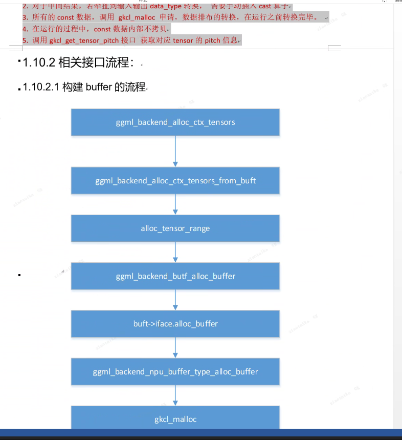
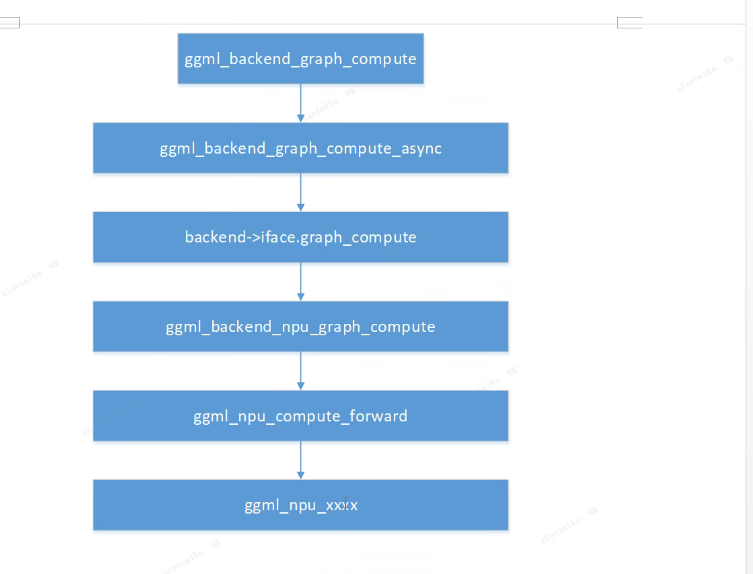
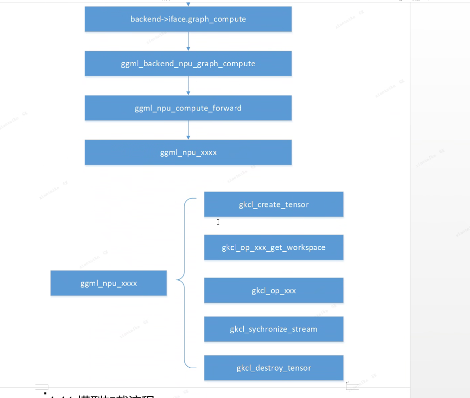
硬件排列格式
#### nc1whc0
##### 理解 NCHW 到 NC₀HWC₁ 的排布转换

`NC₀HWC₁` 是一种用于优化硬件计算的内存排布方式，常见于昇腾 NPU 等设备中。这种排布通过将通道维度（C）拆分为两个维度（C₀ 和 C₁），更好地匹配硬件的计算单元结构（如脉动阵列）。下面我将通过可视化和具体步骤解释从标准的 NCHW 到 NC₀HWC₁ 的转换过程。


##### 1. 原始 NCHW 排布

假设我们有一个形状为 `[N=1, C=4, H=2, W=2]` 的张量，其逻辑结构如下：

```
# NCHW 逻辑排布（C=4 个通道，每个通道 2×2 像素）
通道0: [[0, 1],    通道1: [[4, 5],    通道2: [[8, 9],    通道3: [[12, 13],
        [2, 3]]            [6, 7]]            [10, 11]]           [14, 15]]

# 内存中的一维排列（行优先）
[0,1,2,3, 4,5,6,7, 8,9,10,11, 12,13,14,15]
```


##### 2. 确定 C₀ 和 C₁ 的值

在 NC₀HWC₁ 排布中，需要将原始通道数（C）拆分为：
- **C₀**：向量单元宽度，通常与硬件计算单元匹配（如 16 或 32）
- **C₁**：通道分组数，满足 `C = C₁ × C₀`

对于我们的例子（C=4），假设选择 `C₀=2`，则 `C₁ = C/C₀ = 4/2 = 2`。


##### 3. 重新组织数据：NCHW → NC₀HWC₁

转换步骤如下：

1. **按 C₀ 分组通道**：将 4 个通道分为 2 组（C₁=2），每组 2 个通道（C₀=2）
2. **按 HW 遍历每个位置**：对于每个空间位置 (h,w)，依次访问每组通道
3. **内存排列顺序**：`N → C₁ → H → W → C₀`

转换后的逻辑结构：

```
# 分组1（C₁=0，包含通道0和通道1）
通道0: [[0, 1],    通道1: [[4, 5],
        [2, 3]]            [6, 7]]

# 分组2（C₁=1，包含通道2和通道3）
通道2: [[8, 9],    通道3: [[12, 13],
        [10, 11]]           [14, 15]]

# 内存中的一维排列（按 NC₀HWC₁ 顺序）
[0,4, 1,5, 2,6, 3,7,    # 分组1（C₁=0）的所有位置
 8,12, 9,13, 10,14, 11,15]  # 分组2（C₁=1）的所有位置
```


##### 4. 代码示例（模拟转换过程）

下面的代码展示了如何手动实现 NCHW 到 NC₀HWC₁ 的转换：

```python
import torch

# 创建 NCHW 张量
n, c, h, w = 1, 4, 2, 2
tensor_nchw = torch.arange(n*c*h*w).reshape(n, c, h, w)

# 定义 C₀ 和 C₁
c0 = 2  # 向量单元宽度
c1 = c // c0  # 通道分组数

# 重新排列为 NC₀HWC₁
tensor_nc0hwc1 = tensor_nchw.reshape(n, c1, c0, h, w).permute(0, 1, 3, 4, 2)

print("NCHW 形状:", tensor_nchw.shape)  # 输出: [1, 4, 2, 2]
print("NCHW 内存布局:", tensor_nchw.flatten())
# 输出: [0, 1, 2, 3, 4, 5, 6, 7, 8, 9, 10, 11, 12, 13, 14, 15]

print("NC₀HWC₁ 形状:", tensor_nc0hwc1.shape)  # 输出: [1, 2, 2, 2, 2]
print("NC₀HWC₁ 内存布局:", tensor_nc0hwc1.flatten())
# 输出: [0, 4, 1, 5, 2, 6, 3, 7, 8, 12, 9, 13, 10, 14, 11, 15]
```

### 5. 为什么要这样转换？

这种排布优化主要针对硬件计算：
- **数据局部性**：同一计算单元（如脉动阵列）可高效处理连续的 C₀ 个通道数据
- **并行计算**：多个 C₁ 分组可分配到不同计算核心并行处理
- **内存访问**：减少跨缓存行的数据读取，提升吞吐量

例如，昇腾 NPU 的 AICore 采用 16×16 的脉动阵列，适合处理 C₀=16 的数据块，此时将大通道数按 C₁ 分组可充分利用硬件并行性。
### 注意
- 修改内存访问顺序：通过调整 stride 元信息改变维度访问顺序，通常不立即拷贝数据。
- 非连续张量：生成的张量可能是非连续的（元素在内存中不按逻辑顺序排列），需调用 contiguous() 强制连续。


#### bmn
nchw -》 bm1
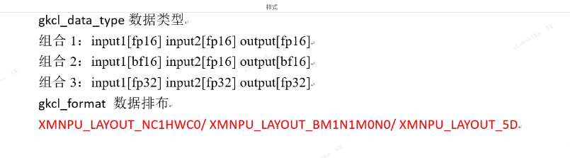
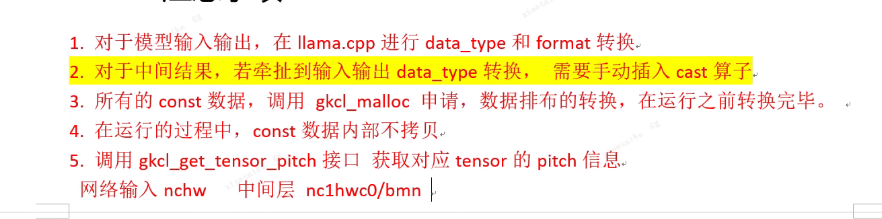
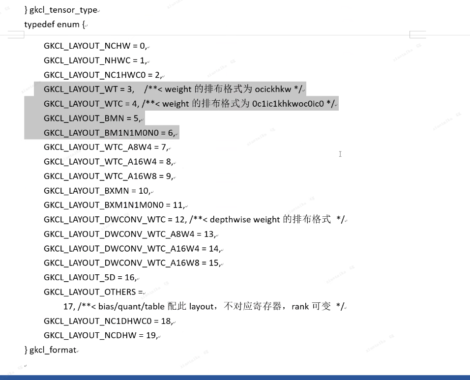
中间结果支持硬件cast函数（子数normalize）
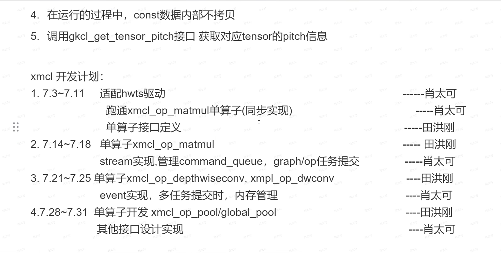

fp16
fp16 + 量化

### cv
工具链编译，扔给驱动直接出结果，不需要运行时接口

### 高性能
llama.cpp传整图，编译后走完整runtime

### 具体算子实现
#### matmul
输出+reshape+transpose
llama.cpp差异（对比pytorch）
#### reshape
逻辑偏移，后序是否连续

#### sofxmax
llama.cpp里实现，softmax掩码实现在了softmax里

### 开发形态
#### docker

#### fpga

### 生图框架
#### comfy ui
#### stable diffusion.cpp
每次forward 都需要重新build，图动态转静态


## 芯片架构学习资源
- zomi博客
https://developer.aliyun.com/article/1643218?spm=a2c6h.13262185.profile.10.219e76b4yOkWuk

### SIMD 与SIMT芯片架构
- https://developer.aliyun.com/article/1643218?spm=a2c6h.13262185.profile.10.219e76b4yOkWuk
- https://developer.aliyun.com/article/1643220?spm=a2c6h.13262185.profile.9.5a0376b4ihH2o3
- https://developer.aliyun.com/article/1643242?spm=a2c6h.13262185.profile.7.5a0376b4ihH2o3

### 算子优化指标与编程范式
https://developer.aliyun.com/article/1644046?spm=a2c6h.13262185.profile.33.2c4521f77FIgCm

### gpu架构-tensorcore
https://developer.aliyun.com/article/1642224?spm=a2c6h.13262185.profile.27.219e76b4yOkWuk

### ai芯片架构能耗问题
https://www.cnblogs.com/wujianming-110117/p/18234286

## llm硬件控制算子
### 动态与静态
动态moe


## 量化
### 对称量化
有符号数

### 非对称量化
无符号数


## 业界存储形态
bm1n1m0n0性能最好，功耗最低
你提到的这些数据排布（如NCHW、NHWC、NC1HWC0、BMN、bmn1n1m0n0）本质上是**多维张量在内存中的存储顺序规则**，用于规范不同维度的数据如何映射到连续的内存地址中。它们的设计通常与硬件架构（如GPU、专用AI芯片）的计算效率密切相关，不仅限于CV领域，在LLM等其他AI场景中也可能因计算需求或硬件约束而存在类似的多维维度划分。


### 【AI系统】昇腾数据布局转换


**简介：** 华为昇腾NPU采用独特的NC1HWC0五维数据格式，旨在优化AI处理器的矩阵乘法运算和访存效率。此格式通过将C维度分割为C1份C0，适应达芬奇架构的高效计算需求，支持FP16和INT8数据类型。此外，昇腾还引入了NZ分形格式，进一步提升数据搬运和矩阵计算效率。AI编译器通过智能布局转换，确保在不同硬件上达到最优性能。

NHWC 的数据排布方式更适合多核 CPU 运算， NCHW 的数据排布方式更适合 GPU 并行运算。那么接下来让我们了解一下在华为昇腾的 NPU 中，这种特征图的存储方式。

> 截止到 2024 年，华为昇腾在私有格式的数据处理和特殊的数据形态越来越少，主要是得益于 AI 编译器和软件的迭代升级，更加合理地兼容业界主流的算子和数据排布格式。


#### 昇腾数据排布格式


数据排布格式的转换主要是将内部数据布局转换为硬件设备友好的形式，实际在华为昇腾的 AI 处理器中，为了提高通用矩阵乘法运算和访存的效率，一般既不选择 NHWC，也不选择 NCHW 来对多维数据进行存储。

这里我们将华为昇腾的数据排布作为一个案例，这种多维数据统一采用 NC1HWC0 的五维数据格式进行存储，具体的含义是将数据从 C 维度分割成 C1 份 C0。

如下图中所示，下图中将 N 这个维度进行了省略，原先的红色长方体展现的是 CHW 三个维度，将它在 C 维度分割成 C1 个长方体，每个长方体的三个维度为 C0HW，而后将这 C1 份长方体在内存中连续排列，此处的 C1=C/C0，如果不能除尽则向上取整，对应着上半篇中的内存对齐，也就是通道现在变成了 C0 个，其中 C0 对于 FP16 类型为 16，对于 INT8 类型则为 32，这部分数据需要连续存储。


这样子的数据排布我们从硬件的角度来进行分析，华为的达芬奇架构在 AI Core 中特意优化了矩阵乘法单元，矩阵计算单元可以快速完成两个 16x16 矩阵的相乘运算，等同于可以在极短时间内进行 163\=409616^3=4096\\quad\\quad\\quad 个乘加运算，并且可以实现 FP16 的运算精度，也就是说其可以针对 16 个 FP16 类型的数据进行快速的计算。这也就是我们对 C0 在 FP16 类型取 16，INT8 类型取 32 的部分原因。

下面我们来介绍一下如何转换出 NC1HWC0 数据格式，即将 NHWC 转换为 NC1HWC0 数据格式。具体操作：

1.  将 NHWC 数据在 C 维度进行分割，变成 C1 份 NHWC0。
    
2.  将 C1 份 NHWC0 在内存中连续排列，由此变成 NC1HWC0。
    

pytorch 中代码如下所示

    Tensor.reshape([N, H, W, C1, C0]).transpose([0, 3, 1, 2, 4])
    

将 NCHW 转换为 NC1HWC0 数据格式

    Tensor.reshape([N, C1, C0, H, W]).transpose([0, 1, 3, 4, 2])
    

#### Fractal Z & NZ 格式


ND 格式 （N-Dimension），是神经网络中最常见且最基本的张量存储格式，代表 N 维度的张量数据。

为了在达芬奇架构中更高效的搬运和进行矩阵计算，引入一种特殊的数据分形格式，NZ 格式。  
如下图所示，我们以 4\*4 的矩阵来进行举例，按照 NZ 格式数据在内存中的排布格式为\[0，1，4，5，8，9，12，13，2，3，6，7，10，11，14，15\]，按照 ND 格式数据在内存中的排布格式为\[0， 1，2，3，4，5，6，7，8，9，10，11，12，13，14，15\]。


如下图所示，NZ 分形操作中，整个矩阵被分为（H1 \* W1）个分形，分形之间按照列主序排布，即类比行主序的存储方式，列主序是先存储一列再存储相邻的下一列，这样整体存储形状形如 N 字形；每个分形内部有（H0 \* W0）个元素，按照行主序排布，形状如 Z 字形。


下面我们详细地对 NZ 格式（也被称为 NW1H1H0W0 格式）具体在内存中存储的维度优先顺序进行展开。先对一个分形内部进行行主序存储，再在一个完整矩阵中以分形宽度为划分，进行列主序存储，再依次对相邻的下一个矩阵进行存储。即此方式先按 W0 方向存储，再按 H0 方向存储，接着按照 H1 方向存储，随后按照 W1 方向存储，最后按 N 方向存储，直到所有数据存储完成。

下面我们介绍一下如何将 ND 数据格式转换为 NZ 数据格式：

将 ND 转换为 NZ 数据格式

    (..., N，H, W )->
    pad->
    (..., N, H1*H0, W1*W0)->
    reshape->
    (..., N, H1, H0, W1, W0)->
    transpose->
    (..., N, W1, H1, H0, W0)
    

其中 pad 为平铺操作，reshape 将张量进行拆分，形状重塑，transpose 为转置操作。

除了 ND 和 NZ 格式，还有其他数据格式，如下图所示，图中最左侧小 z 大 Z，即为 ND 格式示意图，块内按照行排序，块间也按照行排序，常用于特征图的数据存储。

图中中间部分为小 n 大 Z，块内按照列排序，块间按照行排序，常用于权重的数据存储。图中右侧部分为小 z 大 N，即为 NZ 格式示意图，块内按照行排序，块间按照列排序，常用于卷积结果的输出。


#### AI 编译器布局转换算法


了解了基础知识与部分硬件中应用后，我们来了解一下在 AI 编译器中如何对数据布局进行转换优化。

首先，我们转换数据布局的目的是将将内部数据布局转化为后端设备（硬件）友好的形式，我们需要做的是尝试找到在计算图中存储张量的最佳数据布局，然后将布局转换节点插入到图中。

但其中有个需要十分注意的地方，布局转换也是需要很大的开销的，一旦涉及布局转换，就会有 I/O 操作，其产生的代价能否比的上数据格式转换后带来的性能优化也是需要我们重点考虑的部分。

具体地来说，比如 NCHW 格式操作在 GPU 上通常运行得更快，所以在 GPU 上转换为 NCHW 格式是较为有效的操作。

一些 AI 编译器依赖于特定于硬件的库来实现更高的性能，而这些库可能需要特定的布局，比如华为昇腾的 AI 编译器就依赖于 CANN 库，其中的特定布局我们在上文中已经提到。

同时也有许多设备需要配备异构计算单元，比如手机，其 SOC 中有丰富的 IP，arm 端侧的 GPU 还有 ISP 以及 DPU 等一系列不同计算单元。不同的单元可能需要不同的数据布局以更好地利用数据，这就需要 AI 编译器提供一种跨各种硬件执行布局转换的方法。

下面我们来看看数据转换具体是如何操作的。如下图所示，这两个都是数据转换的算子，数据转换我们在这里用 CASTDATA 算子来表示，左侧输入的数据格式为 NHWC，输出的数据格式为 NCHW，那么就需要一个数据转换算子节点来将数据格式由 NHWC 转换为 NCHW，右侧则相反过来，此处不再赘述。


接下来，我们来看略复杂一些的数据转换。如下图所示，首先像最左侧，此处我们两个算子使用的数据格式与输入输出时都相同，为 NCHW，那么此时 AI 编译器中就不需要加入数据转换节点。

中间部分，输入的数据格式为 NCHW，算子一需求的数据格式为 NHWC，需要在两者之间插入一个 CASTDATA NCHW TO NHWC 算子进行数据转换，算子二格式也为 NHWC，数据格式相同，不需要转换，输出的数据格式为 NCHW，那么在算子二到输出间需要插入一个 CASTDATA NHWC TO NCHW 算子进行数据转换。

最右侧的图中，输入的数据格式为 NCHW，算子一需求的数据格式为 NHWC，需要在两者之间插入一个 CASTDATA NCHW TO NHWC 算子进行数据转换，算子二格式为 NCHW，需要在算子一到算子二之间插入一个 CASTDATA NHWC TO NCHW 算子进行数据转换。输出与算子二数据格式相同，不做额外处理。


首先我们来讲解一下训练场景下 AI 编译器的例子，例如 1×1 的卷积常常使用 NHWC 的数据格式，而如果到后面使用的是 3×3 的卷积常常使用 NCHW 的数据格式，AI 编译器此时能够感知上下文，得到这些存储格式的信息，这时候 AI 编译器就会根据具体的数据格式插入需要的转换算子，并且整个过程不会改变原先原计算图的其他内容。

再假设此时我们使用的是三个连续的 1×1 的卷积算子，使用的都是 NHWC 的数据格式，算子之间的数据格式是一样的，那么此时 AI 编译器需要取消掉多余的转换算子。

接着我们来讲解一下推理场景下 AI 编译器与训练场景下有什么不同，其中较大的区别是与会有在权重数据进行布局的转换。假设训练时使用的是 GPU 对神经网络进行训练，但是推理的时候会在更多的场景下进行使用，比如手机上进行推理，手机上较多使用的是 CPU，其进行推理时与在 GPU 上进行训练时的权重数据的布局可能会有所不同，那么此时就需要 AI 推理编译器插入一个权重布局的转换。

### 达芬奇架构四大计算单元详解
https://developer.aliyun.com/article/1642737?spm=a2c6h.13262185.profile.13.5a0376b4ihH2o3


## npu精度
### 《NPU与GPU间为什么会有精度误差？！》笔记
#### 1. 数学层面：浮点数运算的特性
- 浮点数不满足数学上的交换律和结合律，不同的计算顺序和分组方式会导致结果差异。
  - 举例：0.1、0.2、0.3、0.4、0.5、0.6通过不同分组累加，结果分别为2.1和2.0999996。
- 结论：即使相同输入和芯片，因数据切分策略、交换/结合方式不同，结果也可能不同；不同芯片间更难等价。


#### 2. 硬件层面：实现方式的差异
- **浮点计算单元设计不同**：不同厂商的FPU（浮点计算单元）在流水线设计、乘法器/加法器位宽优化、数据处理方式上有差异。
  - 英伟达GPU（如A100、H100）采用复杂累加器，Tensor Core针对矩阵优化。
    - 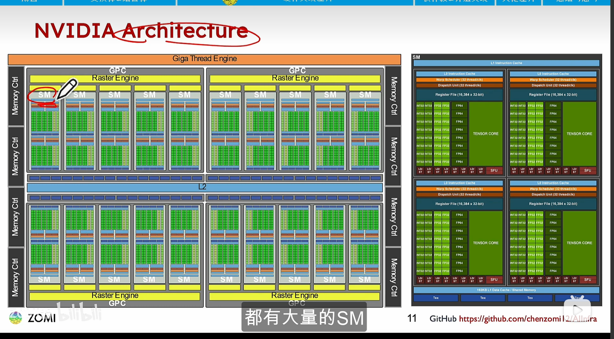
    - 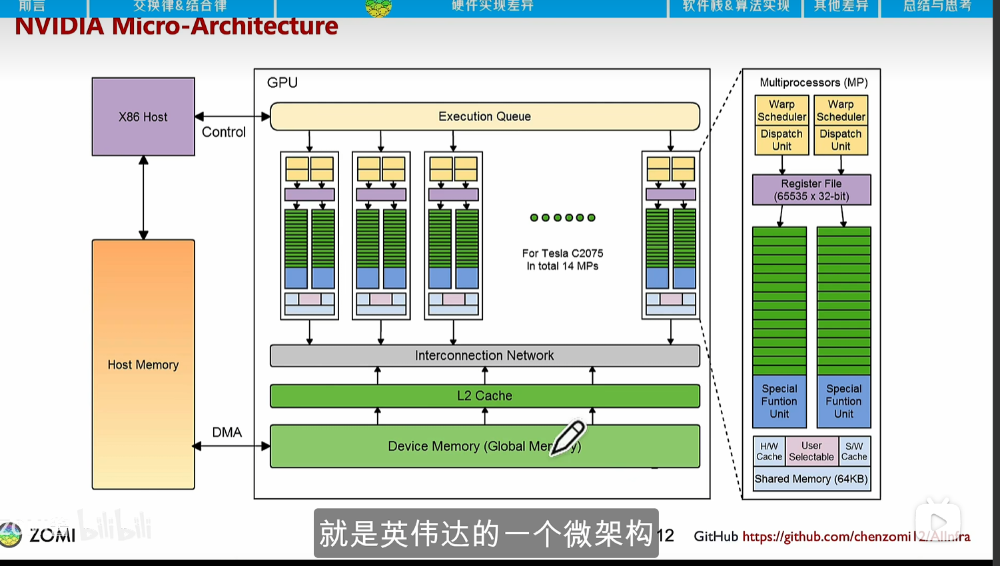
  - 华为昇腾NPU（如A1、A2）的Cube Core专为AI矩阵计算优化，属DSA架构（领域特定架构）。
    - 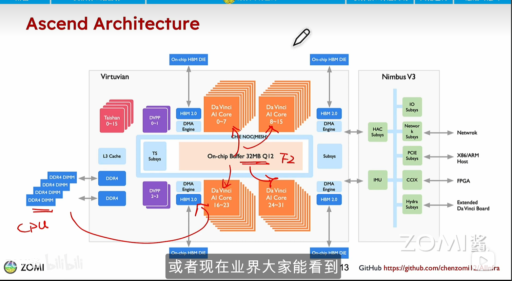
    - 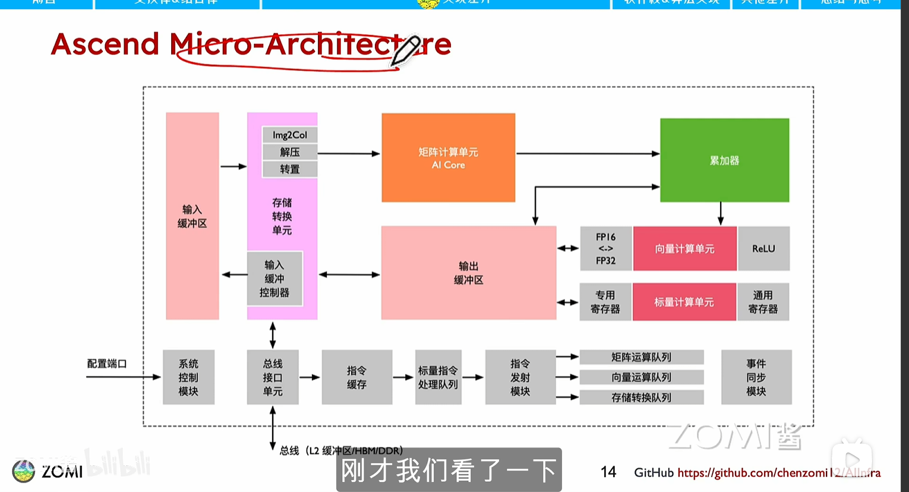
- **精度格式缺乏统一标准**：IEEE 754标准未涵盖FP16、BF16、FP8等AI常用精度格式，厂商可自主实现（如英伟达FP8与华为Half8），导致硬件天然存在差异。


#### 3. 软件与算法层面：实现策略的差异
- **底层数学库不同**：英伟达依赖cuBLAS，昇腾依赖CANN算子库，矩阵分块（tiling）、循环展开等策略不同，影响浮点数累加顺序。
- **编译器优化差异**：英伟达nvcc与昇腾编译器对指令重排、融合的处理不同，进一步影响计算结果。


#### 4. 并行计算层面：非确定性
- 线程调度顺序、数据同步时机存在不确定性，不同硬件（如GPU的多线程调度与NPU的单指令多数据架构）的数据更新时序不同，引入误差。


#### 5. 累积误差：舍入误差的叠加
- 浮点数运算中的舍入误差会随计算步骤累积，且因缺乏统一标准，误差范围难以完全一致。


#### 总结
- **误差的普遍性**：GPU不同代产品（如A100与H100）、GPU与NPU、不同NPU产品间均存在精度误差，NPU因架构跨度大，误差可能更明显。
- **误差的可控性**：精度误差通常在小数位后千位级别，可控制在合理范围，不影响大模型性能（如DeepSeek用FP8训练效果良好）。
- **模型的适应性**：AI模型泛化性强，低精度计算不会显著降低性能，无需追求绝对精度一致。


